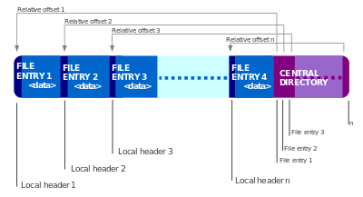

\begin{titlepage}
	\centering
	{\scshape\LARGE Université de Lorraine \par}
	\vspace{1cm}
	{\scshape\Large M2 MIAGE Systèmes d’informations distribués\par}
	{\scshape\Large Sécurité\par}
	\vspace{1.5cm}
	{\huge\bfseries Analyse forensique\par}
	\vspace{2cm}
	{\Large\itshape Mathieu Mourot\par}
	{\Large\itshape Guillaume Pierson\par}
	\vfill
	License\par
	\textsc{CC BY 4.0}
	\vfill

% Bottom of the page
	{\large \today\par}
\end{titlepage}

\newpage
  \pagenumbering{roman}
  \tableofcontents
\newpage
\pagenumbering{arabic}

# Présentation du sujet

## SSTIC

L'objectif du Symposium sur la sécurité des technologies de l'information et des communications (SSTIC) L'objectif du SSTIC est de provoquer
 la rencontre et la discussion entre ces publics très variés, autour de présentations sur l'état actuel de la sécurité informatique en France et dans le monde.
 
## Objectif du challenge
 
Avec une image de mémoire d’un téléphone sous Android, retrouver un mail de la forme @sstic.org et y envoyer un mail pour valider la résolution du challenge.
Pour ce challenge deux critères ont été pris en compte, la rapidité et la qualité du rapport.

## Rappel de ce qu'est une analyse forensique

C’est l’action d’acquérir, de recouvrer, de préserver, et de présenter des informations traitées par le système d’information et stockées sur des supports informatique.

Elle fait suite à un incident tel que la compromission d’un serveur ou est utilisé dans d’autres cas tels que la recherche de preuves pour la pédocriminalité ou l’analyse après une infection par un malware

# Présentation d'une possible solution

Lors de la rédaction de ce rapport, nous avons allégé la présentation, celle d'origine fait 64 pages sans prendre en compte les annexes du fichier pdf. 

<http://static.sstic.org/challenge2010/ebalard.pdf>

## Analyse du fichier récupéré

Outils utilisés :

* file
* 7z
* strings

Le fichier récupéré est une archive qui contient la mémoire du système Android.

Ensuite, une fois la mémoire extraite, on recherche des occurrences avec le sujet sstic et anssi grâce à la commande strings. On trouve deux résultats, deux applications android (apk).

## Récupération des APKs

Pour la récupération des APKs à partir de la mémoire, il y a eu plusieurs possibilités reconstituer toute la mémoire, ou une approche à partir de la particularité des fichiers APKs.

En effet, les APKs ressemblent à des JAR du fait qu'Android utilise un environnement très semblable à celui de Java. On peut donc en déduire que les APKs sont en fait des fichiers archivés au format ZIP.

Les fichiers sont donc sous la forme : 	

* ZIP End of Central Directory Record
* ZIP Central Directory File Header
* ZIP Local File Header
		
	